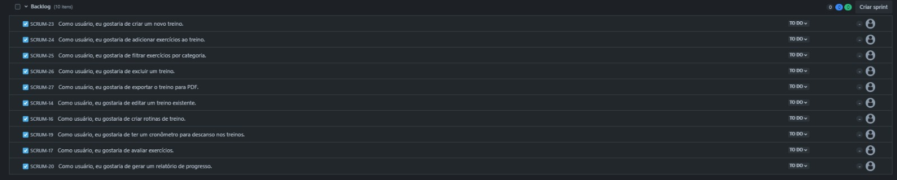
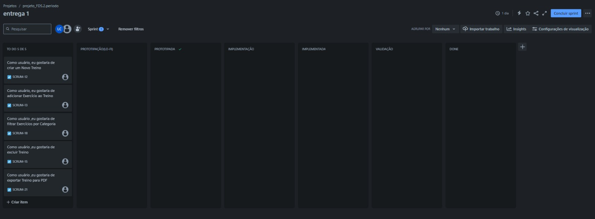
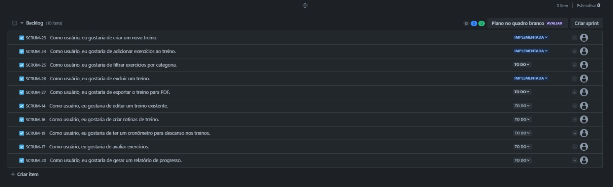
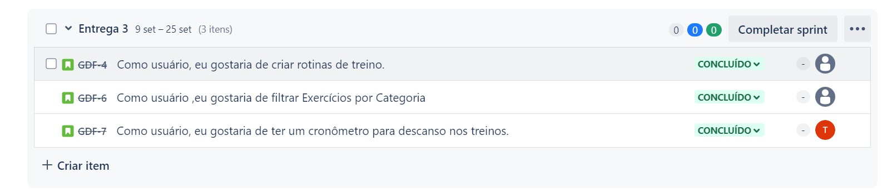
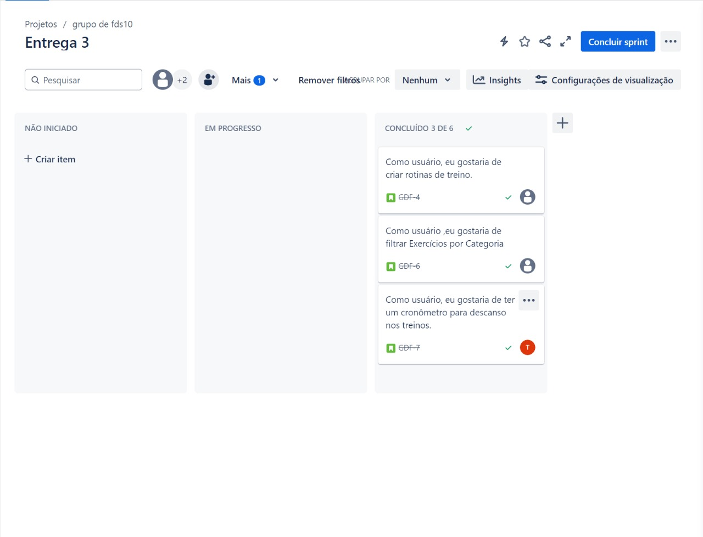

<!DOCTYPE html>
<html lang="pt-BR">
<head>
    <meta charset="UTF-8">
    <meta name="viewport" content="width=device-width, initial-scale=1.0">
</head>
<body>
 

<h1 align="center">Projeto-FDS</h1>

<h1 class="img-row">
    
    
    
</h1>

[Entrega 1](#entrega1) &nbsp;|&nbsp; [Entrega 2](#entrega2) &nbsp;|&nbsp; [Entrega 3](#entrega3) &nbsp;|&nbsp; [Entrega 4](#entrega4) &nbsp;|&nbsp; [Linguagens](#linguagens) &nbsp;|&nbsp; [Colaboradores](#colaboradores)

 

<h2>💻 Projeto</h2>

<h3>O que consiste esse projeto</h3>

 
✔️ Criação e Personalização de Treinos: Usuários podem criar seus próprios planos de treino, escolher entre diferentes tipos de exercícios (como musculação, cardio, HIIT), ou seguir planos personalizados criados por treinadores.
  
✔️ Agenda de Treinos: Um calendário integrado permite agendar treinos, acompanhar a frequência, e receber notificações de lembrete, tanto para usuários quanto para treinadores.
  
✔️ Registro de Progresso: Os usuários podem registrar e acompanhar suas medidas corporais, peso, e desempenho nos exercícios, com gráficos de evolução disponíveis para análise.
  
✔️ Biblioteca de Exercícios: Uma vasta coleção de exercícios com descrições, instruções de execução e vídeos demonstrativos, que pode ser filtrada por grupo muscular ou tipo de equipamento.
  
✔️ Gestão de Planos Alimentares: Criação e acompanhamento de planos alimentares personalizados, que podem ser integrados com os planos de treino para melhor desempenho.
  
✔️ Monitoramento em Tempo Real: Ferramentas como temporizador e contador de repetições ajudam os usuários a monitorar e registrar automaticamente seu desempenho durante os treinos.
  
✔️ Sistema de Metas e Recompensas: Define metas de treino e alimentação, recompensando os usuários por objetivos alcançados e incentivando a continuidade.
  
✔️ Comunidade e Suporte Social: Um espaço para interação entre usuários, onde podem trocar dicas, compartilhar resultados, e motivar uns aos outros.
  
✔️ Relatórios e Análise de Desempenho: Geração de relatórios detalhados sobre o desempenho, com sugestões de ajustes tanto no treino quanto na dieta.
  
✔️ Integração com Dispositivos Wearables: Sincronização com dispositivos como smartwatches para coletar e analisar dados de atividade física e saúde, oferecendo um acompanhamento mais preciso.
 

<h4>Esse tipo de aplicativo não só facilita a gestão e execução dos treinos, como também promove uma conexão entre treinadores e usuários, proporcionando uma experiência mais personalizada e eficiente no alcance de objetivos de fitness.</h4>

 

<h2 id="linguagens">🚀 Linguagens</h2>

Esse projeto foi desenvolvido com as seguintes tecnologias:

 ✔️ Python
 ✔️ JavaScript
 ✔️ HTML
 ✔️ CSS

 

<h2>⚙ Configuração</h2>

> ...

> ...

  

    
Colaboradores

    <table>
        <tr><td>Antonio Crisanto</td><td>Email: actf@cesar.school</td></tr>
        <tr><td>Artur Dowsley</td><td>Email: abd2@cesar.School</td></tr>
        <tr><td>Israel Duclerc</td><td>Email: imdn@cesar.school</td></tr>
        <tr><td>Lucas Calabria</td><td>Email: Lvc@cesar.school</td></tr>
        <tr><td>Samuel Abreu</td><td>Email: slag@cesar.school</td></tr>
        <tr><td>Victor Paes</td><td>Email: vplpc@cesar.school</td></tr>
    </table>

    
Links

    
jira: https://proj2fds.atlassian.net/jira/software/projects/SCRUM/boards/1

    
youtube: https://youtu.be/eAx2HIiVcNo

    
Figma: https://www.figma.com/design/7uzbywBVRUZOanrbKkbBbh/esboço-1?node-id=0-1&node-type=CANVAS&t=T1DQJtKr8ENyUwRv-0

<!-- Entrega 1 -->

    
Entrega 1

    

        
Backlog

        <h3>Print do quadro e backlog (JIRA):</h3>
         
        
        
    

<!-- Entrega 2 -->

    
Entrega 2

    

        
Backlog

        <h3>Print do quadro e backlog (JIRA):</h3>
         
        
        
    

    

        
Screencast

        
https://youtu.be/_T8fp4fx_nA

    

<!-- Entrega 3 -->

    
Entrega 3

    

        
Backlog

        <h3>Print do quadro e backlog (JIRA):</h3>
         
        
        
    

    

        
Screencasts

        
Figma: 

        
Testes automatizados 

        

<!-- Entrega 4 -->

    
Entrega 4

    <h3>Entrega 4...</h3>

  

<h1>🔧 Em construção... 🔧</h1>

</body>
</html>
