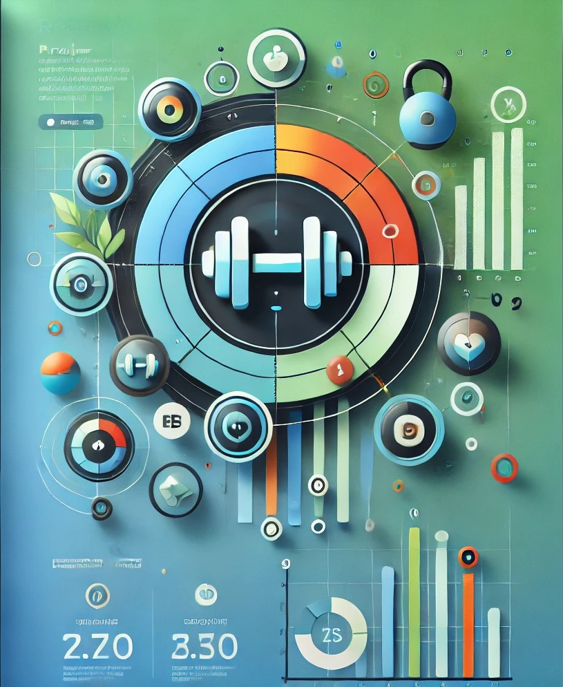
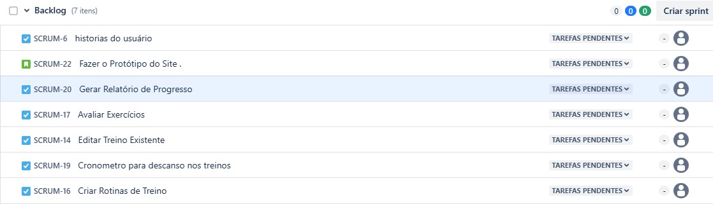

 <h1 align="center">
   Projeto-FDS
</h1>
<h1>
  
  
  
</h1>

 

## 💻 Projeto

<h3>O que consiste esse projeto</h3>

 
✔️Criação e Personalização de Treinos: Usuários podem criar seus próprios planos de treino, escolher entre diferentes tipos de exercícios (como musculação, cardio, HIIT), ou seguir planos personalizados criados por treinadores.

 

✔️Agenda de Treinos: Um calendário integrado permite agendar treinos, acompanhar a frequência, e receber notificações de lembrete, tanto para usuários quanto para treinadores.

✔️Registro de Progresso: Os usuários podem registrar e acompanhar suas medidas corporais, peso, e desempenho nos exercícios, com gráficos de evolução disponíveis para análise.

✔️Biblioteca de Exercícios: Uma vasta coleção de exercícios com descrições, instruções de execução e vídeos demonstrativos, que pode ser filtrada por grupo muscular ou tipo de equipamento.

✔️Gestão de Planos Alimentares: Criação e acompanhamento de planos alimentares personalizados, que podem ser integrados com os planos de treino para melhor desempenho.

✔️Monitoramento em Tempo Real: Ferramentas como temporizador e contador de repetições ajudam os usuários a monitorar e registrar automaticamente seu desempenho durante os treinos.

✔️Sistema de Metas e Recompensas: Define metas de treino e alimentação, recompensando os usuários por objetivos alcançados e incentivando a continuidade.

✔️Comunidade e Suporte Social: Um espaço para interação entre usuários, onde podem trocar dicas, compartilhar resultados, e motivar uns aos outros.

✔️Relatórios e Análise de Desempenho: Geração de relatórios detalhados sobre o desempenho, com sugestões de ajustes tanto no treino quanto na dieta.

✔️Integração com Dispositivos Wearables: Sincronização com dispositivos como smartwatches para coletar e analisar dados de atividade física e saúde, oferecendo um acompanhamento mais preciso.

<h4>Esse tipo de aplicativo não só facilita a gestão e execução dos treinos, como também promove uma conexão entre treinadores e usuários, proporcionando uma experiência mais personalizada e eficiente no alcance de objetivos de fitness.</h4>

 

## 🚀 Linguagens

Esse projeto foi desenvolvido com as seguintes tecnologias:

✔️Python

✔️JavaScrpit

✔️HTML

✔️CSS

✔️...

✔️...

✔️...

✔️...

✔️...

 

## ⚙ Configuração

> ...

>...
  

 

Colaboradores

<table>
  <tr>
    <td>Antonio Crisanto</td>
    <td> Email: tom.filho2006@gmail.com</td>
  </tr>
  <tr>
    <td>Artur Dowsley</td>
    <td> Email: arturbdowsley@gmail.com</td>
  </tr>
  <tr>
    <td>Israel Duclerc</td>
    <td> Email: imdn@cesar.school</td>
  </tr>
  <tr>
    <td>Lucas Calabria</td>
    <td> Email: lvcalabria@gmail.com</td>
  </tr>
  <tr>
    <td>Samuel Abreu</td>
    <td> Email: sam.abreugouveia@gmail.com</td>
  </tr>
  <tr>
    <td>Victor Paes</td>
    <td> Email: vplpc@cesar.school</td>
  </tr>
</table>

 

Links

https://proj2fds.atlassian.net/jira/software/projects/SCRUM/boards/1

Entrega 1

Backlog

 

<h1>🔧Em construção...🔧</h1>